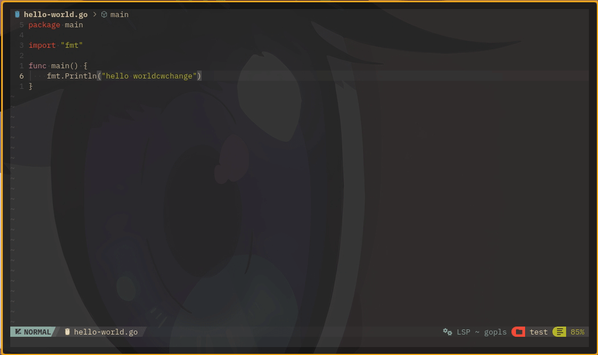

# watch.nvim

A scrollable `watch` alternative for Neovim.



> [!IMPORTANT]
> `watch.nvim` requires `Neovim 0.9.5+`!

`watch.nvim` is a simple plugin for live watching (i.e. continuously rerunning and checking the output of) a shell command in a Neovim buffer. Commands can be run at an interval or only when a file has changed.

#### Use case:

1. You want to `watch` (continuously rerun and check the output of) a shell
   command with changing output, while being able to scroll the output, all
   without leaving Neovim.
2. You `watch.start()` or `:WatchStart` a shell command.
3. The command's output is continuously loaded in a buffer at the given refresh
   rate.
4. The watcher stops when you call `watch.stop()` or `:WatchStop`, close the
   buffer, or exit Neovim.

For an example, to watch the output of `tree -cdC` in the current directory,
updating every `500` ms:

```vim
:WatchStart tree -cdC 500
```

Keep in mind that a watched command will run in the shell where you
started Neovim.

#### Features:
- [x] Customizable refresh rate
- [x] Stop and start at will
- [x] Scrollable output
- [x] Pause watching when in the background
- [x] Option to open in a configurable split window
- [x] Option to watch for file changes
- [x] Backwards compability with `Neovim 0.9.5`
- [x] ANSI color support
- [x] Avoid dependency with `:terminal` buffer by default

# Requirements

* Neovim 0.9.5+
* [Makaze/AnsiEsc](https://github.com/Makaze/AnsiEsc) (optional, required for ANSI colors if `terminal` is `false`)

# Quickstart

Install using your favorite plugin manager.

Using [lazy.nvim](https://github.com/nvim-telescope/telescope.nvim):

```lua
{
    "Makaze/watch.nvim",
    cmd = { "WatchStart", "WatchStop", "WatchFile" },
}
```

> [!NOTE]
> Calling `.setup()` is not required.

# Configuration

`watch.nvim` has two configuration options. Any ommitted options will default to the standard configuration below. You can change those options by calling `watch.setup()`:

```lua
local watch = require("watch")

watch.setup({
    -------------------- Default configuration -----------------------------
    -- The default refresh rate for a new watcher in milliseconds. Defaults
    -- to `500`.
    refresh_rate = 500,
    -- Whether to automatically delete the buffer when stopping a watcher.
    -- Defaults to `false`.
    close_on_stop = false,
    -- Configuration for split window option
    split = {
        -- Whether to automatically delete the buffer when stopping a
        -- watcher. Defaults to `false`.
        enabled = false,
        -- Where to place the split (above|below|right|left). Defaults to
        -- `below`.
        position = "below",
        -- The size of the split in rows (or columns if position is right or
        -- left). Defaults to `nil`.
        size = nil,
        -- Whether to focus on the newly created split watcher. Defaults to
        -- `true`.
        focus = true,
    },
    -- Whether to enable ANSI colors in output. Requires Makaze/AnsiEsc.
    -- Ignored if `terminal` is set to `true`. Defaults to `false`.
    ANSI_enabled = false,
    -- Whether to open in a terminal buffer. Automatically supports your
    -- terminal's built in ANSI colors. Has higher priority than
    -- `ANSI_enabled`. Defaults to `true`.
    terminal = true,
})
```

# Example Usage

You can use the Lua API or call the commands from the commandline. To watch the command `tree -cdC` every 500 milliseconds and to watch the file `error.log` for changes:

### Lua API

##### Start

```lua
local watch = require("watch")
watch.start("tree -cdC", 1000)      -- Specify 1000 ms refresh
watch.start("tree -cdC")            -- Default to 500 ms refresh
```

##### Stop

```lua
local watch = require("watch")
watch.stop({ file = "tree -cdC" })  -- Stop watching `tree -cdC`
watch.stop()                        -- Stop all watchers
```

##### Watch a File for Changes

```lua
local watch = require("watch")
-- Use `%s` inside the command to insert the absolute path of the current file.
watch.start("cat %s", 3000, nil, "errog.log") -- Specify 3000 ms refresh
watch.start("cat %s", nil, nil, "errog.log")  -- Default to 1000 ms refresh
```

### Ex Commands

##### Start

```vim
:WatchStart tree -cdC 1000          " Specify 1000 ms refresh
:WatchStart tree -cdC               " Default to 500 ms refresh
```

##### Stop

```vim
:WatchStop tree -cdC                " Stop watching `tree -cdC`
:WatchStop                          " Stop all watchers
```

##### Watch a File for Changes

```vim
" With error.log open and focused
:WatchFile cat %s 3000              " Specify 3000 ms refresh on the currently open file
:WatchFile cat %s                   " Default to 1000 ms refresh on the currently open file
```

# Documentation

For examples and technical documentation about commands and the Lua API see `:help watch`.
